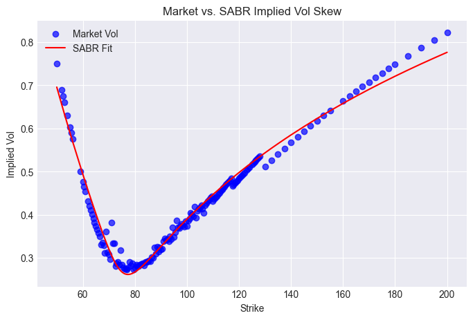
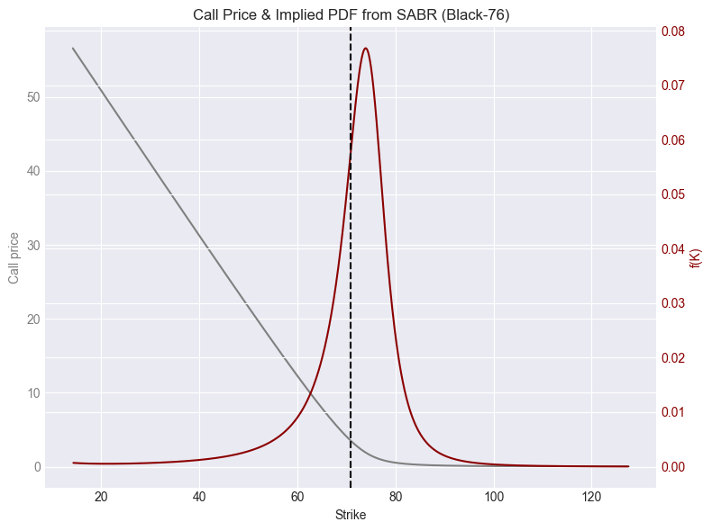

# Extraction and Analysis of Implied Probabilities in Commodity Options

## Overview

This repository contains the implementation for **Extraction and Analysis of Implied Probabilities in Commodity Options**, the final-year thesis project by **Gorka Bravo Díaz** at **Universitat Pompeu Fabra**. The project focuses on extracting risk-neutral probabilities from WTI crude oil options using the **Breeden-Litzenberger** approach and the **SABR** model.

The study integrates options market data with the **WTI futures curve** to analyze how market structure influences the implied probability distribution and higher-order moments (variance, skewness, and kurtosis). This framework provides insights into market sentiment and potential risk management applications.

## Key Areas of Exploration

- Commodity options pricing frameworks (**Black-76 / Black-Scholes**)
- **Butterfly spreads** as proxies for implied probability density functions
- Application of **SABR volatility modeling** for implied distributions
- Integration of **futures term structure analysis** with option-implied moments
- **Data processing, cleaning, and visualization pipelines**

---

## Repository Structure

```plaintext
data/                             # Data files for the project
scripts/                          # Python scripts for data processing and analysis
│   ├── Main.py                   # Main pipeline to run all scripts sequentially
│   ├── Data_Cleaning_Engine.py   # Cleans and preprocesses raw options data
│   ├── Bflys_engine.py           # Computes butterfly spreads and implied probabilities
│   ├── SABR_betas_comp_engine.py # Runs SABR calibration over multiple beta values
│   ├── SABR_engine.py            # SABR model calibration and implied PDF computation
│   ├── Futures_curve.py          # Processes WTI futures curve data and computes indicators
│   ├── Stats_engine.py           # Runs statistical analysis on computed probability distributions
resources/                        # Additional resources (diagrams, images, etc.)
│   ├── pipeline_diagram.png      # Approximate flowchart of the code pipeline
README.md                         # This README file
LICENSE                           # License file for the project
```

---

## Features

### 1. **Data Collection and Cleaning**

- Filters invalid options based on **bid-ask spread, open interest, and implied volatility thresholds**
- Applies **smoothing techniques** to improve data quality

### 2. **Butterfly Spread Construction**

- Computes **butterfly spreads** from option market data
- Estimates implied risk-neutral probability density functions (PDFs)

### 3. **SABR Volatility Modeling**

- Calibrates the **SABR model** to observed option volatilities
- Extracts **implied probability distributions** from calibrated parameters
- Compares different **SABR beta values** to determine the best fit

### 4. **Futures Curve Analysis**

- Analyzes the **WTI futures curve** structure (contango vs. backwardation)
- Computes a **term structure index** summarizing market conditions
- Links futures curve structure to **option-implied probability moments**

### 5. **Statistical Analysis**

- Examines relationships between **futures market conditions and implied distributions**
- Computes statistical measures (**mean, variance, skewness, kurtosis**) from option PDFs
- Evaluates market regime shifts and structural changes in implied risk perceptions

---

## Installation

### Prerequisites

- Python **3.8+**
- Required Python libraries:
  ```bash
  pip install pandas numpy matplotlib scipy statsmodels
  ```

### Steps

1. Clone the repository:

   ```bash
   git clone https://github.com/yourusername/commodity-options-analysis.git
   cd commodity-options-analysis
   ```

2. Install dependencies:

   ```bash
   pip install -r requirements.txt
   ```

3. Run the main pipeline:

   ```bash
   python Main.py
   ```

---

## Example Results

### **SABR IV Fit**



### **SABR-Implied Probability Density Function (PDF)**



---

## Citation

If you use this project or its ideas, please cite:

- **"Extraction and Analysis of Implied Probabilities in Commodity Options"** – *Gorka Bravo Díaz, Universitat Pompeu Fabra, Academic Year 2024-2025.*

---

## License

This project is licensed under the MIT License. See the `LICENSE` file for details.


