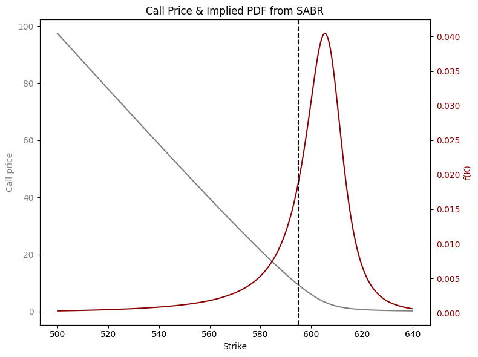

# Extraction and Analysis of Implied Probabilities in Commodity Options

## Overview

This repository contains the implementation for **Extraction and Analysis of Implied Probabilities in Commodity Options**, a final year project by **Gorka Bravo Díaz**. The project focuses on analyzing the oil market and extracting risk-neutral probabilities using commodity option data.

Key areas of exploration include:
- Commodity options pricing frameworks (Black76  / Black-Scholes).
- Butterfly spreads as proxies for implied probability density functions.
- Application of SABR volatility modeling to compute implied distributions.
- Data collection, cleaning, and visualization pipelines.

---

## Repository Structure

```plaintext
data/                             # Data files for the project
scripts/                          # Python scripts for data processing and analysis
│   ├── Main.py                       # Runs all the scripts sequentially
│   ├── Data Collection Engine.py     # Collects SPY (for testing purposes) option chain data using yfinance
│   ├── Data Cleaning Engine.py       # Cleans and preprocesses raw options data
│   ├── Bflys engine.py               # Processes butterfly spreads to extract probabilities
│   ├── SABR betas comp engine.py     # Runs SABR and loops over different betas, pick the one thank makes the most sense!
│   ├── SABR engine.py                # SABR model calibration and implied PDF computation
resources/                        # Additional resources (diagrams, images, etc.)
│   ├── TFG CODE pipeline new status1.png  # Visual representation of the code pipeline
README.md                         # This README file
LICENSE                           # License file for the project
```

---

## Features

### 1. **Data Collection**
- Collects real-time SPY (for example) option chain data using the `yfinance` library.
- Identifies options expiring ~1 month from the current date.

### 2. **Data Cleaning**
- Removes noise and irrelevant columns.
- Filters invalid options data based on bid-ask spread and open interest thresholds.
- Smooths midprices to improve modeling accuracy.
- Removes market vols close to 0.

### 3. **Butterfly Spreads**
- Constructs butterfly spreads from options data.
- Computes implied probabilities and visualizes strike-probability relationships.

### 4. **SABR Volatility Modeling**
- Calibrates the SABR model to observed market volatilities.
- Extracts implied probability density functions (PDFs) from calibrated SABR parameters.
- Evaluates distribution statistics (mean, variance, skewness, kurtosis).

### 5. **Visualization**
- Comprehensive plotting of:
  - Strike vs. Probability
  - SABR Volatility Skew
  - Risk-Neutral PDFs

---

## Installation

### Prerequisites
- Python 3.8+
- Required Python libraries:
  - `pandas`
  - `numpy`
  - `matplotlib`
  - `scipy`
  - `yfinance`

### Steps
1. Clone the repository:
   ```bash
   git clone https://github.com/yourusername/commodity-options-analysis.git
   cd commodity-options-analysis
   ```

2. Install dependencies:
     ```bash
     pip install -r requirements.txt
     ```
## Example Results

### Butterfly Spread Probability Visualization
  


### SABR Implied PDF
  


---

## Citation

If you use this project or its ideas, please cite:
- "Extraction and Analysis of Implied Probabilities in Commodity Options", Gorka Bravo Díaz, Academic Year 2024-2025.

---

## License

This project is licensed under the MIT License. See the `LICENSE` file for details.


